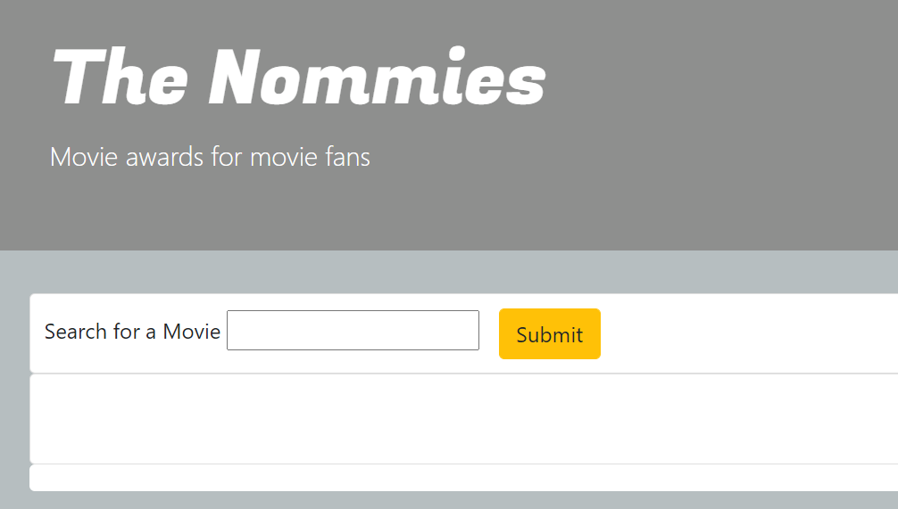

# The Shoppies  

## Description  
A web application that allows users to search for movies and nominate up to five movies for "The Shoppies". Completed as a development challenge for the Summer 2021 Shopify Internship application.

## Table of Contents

* [Technologies Used](#technologies-used)

* [How to Use](#how-to-use)

* [How I Made This](#how-i-made-this)

* [Deployed Application](#link-to-deployed-application)

* [GitHub Repo](#link-to-github-repo)

* [Future Development Ideas](#future-development-ideas)

## Technologies Used    
Built in Visual Studio with          
HTML       
CSS  
Bootstrap 4     
Javascript/jQuery  
OMDB API        

## How to Use    
Navigate to https://alyssahellrung.github.io/theShoppies/. In the search bar, enter the name of any movie and click "Submit".   
  
Details about your movie will appear below the search bar.   
  
If you would like to "nominate" the movie for a Shoppy Award, click "Nominate". The title of your movie will appear in the nomination list.   
  
   
If you would like to delete a nominee later on, you can click the "X" button and it will disappear from the list. If you try to add more than five titles to your nomination list, an alert will appear informing you that you have already reached your limit of five nominations.   
  
If you search for a movie that you have already nominated, the search results will not include a "Nominate" button. 

## How I Made This  
I laid down the basic structure of the page (the heading, search bar, major divs, and cards) using html and bootstrap first, then I set up my ajax call for OMDB and figured out how to harness the pieces of the response I wanted to use on my page. We were only required to show the movie title and release date, but I wanted to also include a short plot summary and especially the poster image because it made the whole page light up and was way more visually interesting than text alone. Then I figured out how to dynamically render the results and how to get the nominees into an array, from which I could render list items if any movies were nominated. After that it was a flurry of setting up event handlers, the "five movie limit" alert, and delete buttons and functionality. I have used all of these techniques before, but it was great to create an app from start to finish by myself while reviewing them.

## Link to Deployed Application
https://alyssahellrung.github.io/theShoppies/

## Link to GitHub Repo    
https://github.com/alyssahellrung/theShoppies

## Future Development Ideas  
--If I were to keep working on this, I would refactor my script because I could definitley streamline some things...  
--...but honestly I would probably remake the whole thing using React if I were to do it again!  
--Add more style!    